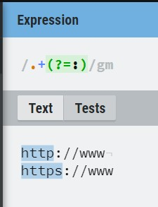
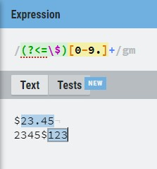
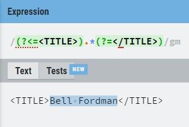
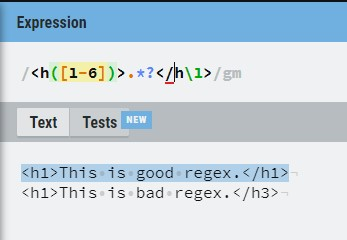

# 💥정규표현식

> 문자열 문제들을 풀다보면 정규표현식이 필요해지는 순간들이 생긴다. 뿐만아니라 추후에 자바스크립트를 통해 프로젝트를 진행할 때에도 정규표현식을 활용해 검증 절차를 거치는 경우가 종종 존재한다. 이런 이유들 때문에 정규표현식에 대한 공부가 필요하다는 생각이 들었고 이렇게 정리하게 되었다.
>
> *정규 표현식을 통달하는 과정에서 구문을 익히는 것은 가장 쉬운 부분임을 알아야 한다. 진정한 도전 과제는 그 구문을 어떻게 적용할 것인지, 주어진 문제를 어떻게 분해해야 정규표현식으로 해결할 수 있는지 익히는 것이다. - 『손에 잡히는 정규표현식 p.5』* 
>
> ^ 띵언이다 명심하자.
>
> 참고한 자료는 총 3가지이다.
>
> - 손에 잡히는 정규표현식(인사이트) - 벤 포터
> - https://www.youtube.com/watch?v=t3M6toIflyQ - 드림코딩엘리
> - https://ko.javascript.info/regexp-introduction

---

### 정규 표현식을 선언하는 2가지 방법

- `let re = new RegExp("pattern", "flags")` - ('긴' 문법)
- `let re = /pattern/flag` - ('짧은' 문법)

두 개의 방법 중 편한 것을 골라서 사용하면 된다. 하지만, 변수에 저장된 문자열을 pattern으로 사용해야 하는 경우에는 반드시 `RegExp`를 사용하여야 한다.

```javascript
//백준 1543 문서검색

const chkStr = input()
const cmpStr = input()

//입력으로 받는 cmpStr을 pattern으로 사용하여야 한다. 이 경우 반드시 긴 문법을 사용한다. 
const re = new RegExp(cmpStr, "g")
let tmp = chkStr.match(re)
console.log((tmp !== null) ? tmp.length : 0)
```

---

### 플래그

> 자바스크립트에는 6가지의 플래그가 존재하지만, 실질적으로 내가 쓰게 될 플래그는 3개 뿐이라고 생각한다. 때문에 3개의 플래그에 대해서만 정리할 예정이고 추후에 다른 플래그를 알아야 할 때 https://ko.javascript.info/regexp-introduction 이곳에 와서 확인하면 되겠다.

- i

  > i 플래그가 붙으면 대소문자의 구분없이 검색한다. (A와 a에 차이가 없게 된다.)

- g

  > g 플래그가 붙으면 패턴과 일치하는 모든 것들을 찾는다. g 플래그가 없으면 패턴과 일치하는 첫번째 결과만을 반환한다.

- m

  > 다중 행 모드를 활성화한다. 여러 줄에서 똑같은 검색을 할 수 있게 된다.

---

### 문자 플래그

- `\d`

  > 숫자(0-9)를 선택한다.

- `\s`

  > 스페이스, 탭(\t), 개행(\n)과 같은 공백 기호들을 선택한다.

- `\w`

  > 모든 문자를 선택한다. 여기서 문자란 대문자(A-Z), 소문자(a-z), 숫자(0-9) 그리고 밑줄(_)을 포함한다.

- `\D`

> 숫자가 아닌 모든 것들이 선택된다. 스페이스, 탭(\t), 개행(\n)같은 것들까지 모두 선택된다.

- `\S`

  > `\s`에서 선택되는 것들 빼고 모두

- `\W`

  > `\w`에서 선택되는 것들 빼고 모두

- .

  > 온점은 줄 바꿈 문자를 제외한 모든 문자와 일치한다. `/./`

  **만약 온전히 온점, 물음표 같은 특수문자들을 선택하고 싶다면 해당 특수문자 앞에 백슬래쉬를 붙이면 된다.**

---

### 앵커 플래그

- `^`

  > `^`는 문장의 시작을 의미한다. `/^Ya/`와 같은 패턴은 문장의 시작이 Ya인 것만 찾게 된다.

- `$`

  > `$`는 문장의 끝을 의미한다.

이 두 종류의 앵커 플래그를 활용하여 완전히 일치하는 문자열들을 찾을 수도 있다.


이 두개의 경우를 통해 앵커 플래그를 붙였을 때와 붙이지 않았을 때를 정확하게 구분할 수 있다.

---

### SET

- |  => 또는
- ()  => 그룹
- []  => 문자셋, 괄호 안의 어떤 문자든 **딱 한 개만 선탁한다**
- [^]  => 부정 문자셋, 괄호 안의 어떤 문자가 아닐 때
- (?:)  => 찾지만 기억하지 않음
- ?  => 있거나 없거나(0개 혹은 1개)
- \*  => 없거나 있거나 많거나(0개 이상 있는 경우)
- \+  => 한 개 있거나 많거나(1개 이상 있는 경우)
- {n}  => n번 반복
- {min,}  => 최소 min번 반복
- {min, max}  => min 이상, max 이하 개수만큼 반복

```javascript
/gr(e|a)y/
//=> grey와 gray를 찾게 된다. 하지만, 이 두 개가 하나의 그룹으로 지정된다.

/gr(?:e|a)y/
//=> grey와 gray를 찾게 된다. 또한, 하나의 그룹으로 지정되지 않는다. 하지만, 보기가 힘들다. 때문에 보통 똑같은 기능을 하지만 간단한 대괄호를 많이 사용한다.

/gr[ea]y/
//=> grey와 gray를 찾는다.

/gr[a-f]y/
//=> gray, grby, grcy, grdy, grey, grfy
   
/[a-zA-Z0-9]/
//=> 이렇게 하면 특수기호를 제외한 모든 문자를 딱 한 개 선택할 수 있다.
  
/[^a-zA-Z0-9]/
//=> 이렇게 하면 특수기호 딱 한 개를 선택하게 된다.
    
/gra?y/
//=> gry와 gray를 찾는다.

/gra*y/
//=> gry, gray, graay, graaay, graaaay, ...
    
/gra+y/
//=> gray, graay, graaay, graaaay, ...

/gra{2}y/
//=> graay를 찾는다.
    
/gra{2, 4}y/
//=> graay, graaay, graaaay를 찾는다.

/gra{2,}y/
//=> graay, graaay ...
```

---

`\b [Cc] [Aa] [Rr] \b`과 같이 코드를 작성하면 대소문자 구분없이 경계의 car를 선택할 수 있다.

> 경계를 선택할 수 있다는 것은 `\b cat \b` 를 통해 `cat`은 선택할 수 있지만 `scattered` 속 `cat`은 선택할 수 없음을 의미한다.

물론, `^[Cc] [Aa] [Rr] $` 이 두 종류의 앵커 플래그를 활용하여도 똑같은 결과물을 도출해낼 수 있다.

하지만, 이 경우 `\b` 를 사용하는 것이 맞는 방법이다.

이 두 가지를 구분하는 구분점은 단어를 경계로 하냐, 문장을 경계로 하냐이다.

단어의 경계를 기반으로 단어를 찾을 때는 `\b - \b` 를 쓰지만,

문장의 경계를 기반으로 문장을 찾을 때는 `^ - $` 를 사용한다.

이 예제의 경우 `car`이라는 하나의 단어만을 찾는 상황이기 때문에 `\b`를 사용하는 것이 맞다.

만약, `car is empty` 와 같이 문장을 찾아야 하는 경우에는 앵커 플래그를 통해 찾으면 된다.

---

부분적으로만 대소문자를 구분하지 않을 때는 [Rr]eg[Ee]x 와 같은 모양으로 표현할 수도 있다.

---

`[A-z]` 로 표현하면 아스키문자 `A`와 아스키문자 `z` 사이에 있는 모든 문자와 일치한다. 하지만, 이런 모양은 사용해서는 안된다. `Z-a` 사이에 몇몇 특수기호들이 들어가 있기 때문에 실수로 해당 특수기호들까지 선택되어버려질 수도 있다.

---

대괄호([]) 안에 캐럿(^) 기호를 넣게 되면 해당 문자나 범위를 제외할 수 있다.

---

대괄호, 캐럿과 같은 메타 문자들을 그대로 가져오기 위해서는 해당 메타 문자 앞에 백슬래쉬(\)를 넣어야 한다.

---

마침표(.)는 어떠한 문자와도 일치한다.(줄바꿈 문자만 빼고)

---

`\r\n` (캐리지 리턴 + 개행) 은 줄의 끝을 나타내는데 사용한다.

`\r\n\r\n` 하면 줄의 끝이 연속해서 두 번 나오는 부분! 즉, 두 레코드 사이의 빈 줄을 선택하게 된다.

하지만, 여기에는 문제가 있는데 Unix, Linux 환경에서는 `\r`은 제외하고 `\n`만을 사용한다. 때문에, `\n` 앞에 `\r`이 있을 경우에만 일치시키는 것이 이상적이다.

=> [\r] ? \n [\r] ? \n 	//[\r] 이 있어도 되고 없어도 됨을 물음표(?)를 통해 나타냈다.

---

### 탐욕적 수량자 vs 게으른 수량자

<br/>

만약, `b tag`와 `b tag`로 둘러쌓인 내용을 파악해야할 때 우리는 아마도 `<[Bb]>.*</[Bb]>` 이런 모양의 정규표현식을 작성할 것이다.

 하지만, 이런 정규표현식을 우리의 의도와는 다른 결과물을 도출시킨다.


기본적으로 `quantifier`는 그리디하기 때문이다! 최대한 길게 결과물을 도출시키려는 특성이 있기 때문에 사진처럼 우리의 의도와는 다르게 문자열을 파싱한다.

그렇다면 원래 의도에 맞게 문자열을 파싱하기 위해서는 어떤 식의 `quantifier`가 필요할까? 바로 그리디 하지 않은 `lazy quantifier`가 필요하다. 이 둘의 코드 상의 차이는 딱 물음표(?) 한 개의 차이이다.


| 탐욕적 수량자 | 게으른 수량자 |
| :-----------: | :-----------: |
|       *       |      *?       |
|       +       |      +?       |
|     {n,}      |     {n,}?     |

---

문자열 그룹이 반복돼야하는 경우에는 소괄호를 통해 하위표현식으로 묶으면 된다.

`(&nbsp;){2,}`와 같은 정규표현식으로 `&nbsp;&nbsp;`혹은 2개 이상의 반복을 선택할 수 있다.

IP 주소 선택을 위한 `\d{1, 3} \. \d{1, 3} \. \d{1, 3}`은 `(\d{1, 3} \.){2} \d{1, 3}`으로 대체할 수 있다.

물론! 통일성을 주겠다고 `(\d{1, 3} \.){2} (\d{1, 3})` 이런 식으로 표현할 수도 있다. 이렇게 해도 동일하게 동작은 하지만, 그룹으로 묶지 않아도 되는 것을 묶게 되면 성능상의 단점을 가지게 될 수 있다.

---

### 전방탐색 vs 후방탐색

- (?=) 긍정형 전방탐색
- (?!) 부정형 전방탐색
- (?<=) 긍정형 후방탐색
- (?<!) 부정형 후방탐색

부정형의 경우 앞뒤에 `\b`가 붙는데 긍정형의 경우의 일부가 잡히는 것을 방지하기 위함이다.(근데 실제로 부정형을 쓸 일이 있을지 모르겠다.)

 `:`을 기준으로 전방을 탐색하고 싶다! (기준이 되는 `:`은 선택X) => 긍정형 전방탐색



`$`을 기준으로 후방을 탐색하고 싶다!(기준이 되는 `$`는 선택X) => 긍정형 후방탐색



TITLE이라는 태그 사이의 값을 가져오고 싶다! => 전후방(동시)탐색



---

## 역참조

> 실제로 코딩 테스트에서 요구하는 정도의 문자열 파싱을 학기 위해서는 이 역참조의 개념이 필요할 때 굉장히 많다. 때문에, 주의 깊게 알아야 할 필요성이 있는 챕터이다. 역시... 그만큼이나 이해하기 어렵기도 하다.

만약, <h1>부터 <h6>까지를 선택할 수 있는 정규표현식이 필요한 상황이라고 가정해보자. 역참조를 모르는 상황이라면 `<h[1-6]>.*?</h[1-6]>` 이런 식으로 정규표현식을 작성할 것이다. 하지만, 이 정규표현식은 문제가 존재한다.	

바로, 여는 태그는 h1이지만 닫는 태그가 h3인 잘못된 경우들도 선택해버린다는 것이다. 이런 문제를 해결하기 위해서 역참조의 개념이 필요하다.



이 사진과 같이 정규표현식을 작성해야만 제대로된 태그들만을 선택할 수 있다.

`\1`라는 부분이 처음 등장했는데, 이것은 그룹화와 관련이 있다. 앞서서 소괄호(())를 사용하면 하나의 그룹으로 만들 수 있다고 언급하였다. 이 그룹의 번호는 먼저 나온 순서대로 1번부터 배정되게 된다. 때문에 `([1-6])`이 소괄호 안에서 선택되는 하나의 숫자가 그룹 번호 1번을 가지게 된다. 이 1번 그룹을 그대로 사용하고 싶다면 `\1`으로 표시해서 사용하면 되는 것이다.


 역참조를 사용하게 되면 여러 치환작업 또한 쉽게 해낼 수 있다.


이메일 형식을 찾아서 a 태그로 감싸주는 모양의 코드이다. 여기서 가장 중요한 것은 위에서는 그룹을 가져올 때 역슬래쉬(\)를 사용한 반면 replace 함수에서는 $를 사용하고 있다. 이 점을 주의깊게 봐야 한다.


이런 식으로 여러 그룹을 만들어서 사용할 수도 있다.


---

## 실제 사용예시!!(앞으로 계속 이곳에 쌓아나갈 예정이다.)

<br/>

### [백준(14405)](https://www.acmicpc.net/problem/14405)

피카츄는 "pi", "ka", "chu"를 발음할 수 있다. 따라서, 피카츄는 이 세 음절을 합친 단어만 발음할 수 있다. 예를 들면, "pikapi"와 "pikachu"가 있다.

문자열 S가 주어졌을 때, 피카츄가 발음할 수 있는 문자열인지 아닌지 구하는 프로그램을 작성하시오.

=>

`const re = /((pi)*(ka)*(chu)*)+/g`

pi, ka, chu 이 3개의 단어가 그룹핑되어서 반복되면 되는 문제였다.

그룹핑을 위해 각각을 소괄호로 묶었으며 0번 이상 반복되면 되기에 `*` 표시를 하였다.

이 전체가 여러번 반복되어도 되기 때문에 전체를 소괄호로 묶고 뒤에 `*` 혹은 `+`를 붙이면 되는 문제였다.

---

### [백준(12865)](https://www.acmicpc.net/problem/12865)

언더바 + 소문자는 대문자로 바꾸고, 대문자는 언더바 + 소문자로 바꾼다.

=>

```javascript
chkStr = chkStr.replace(/_[a-z]/g, (str) => {
        return str[1].toUpperCase()
    })
```

_ + 소문자를 대문자로 바꾸기 위해서는 언더바는 버리고 소문자를 대문자로 바꾸어서 붙이면 되는 구조이다.

때문에 결과를 str으로 받고 str[1] 만을 대문자로 바꾸어서 반환하는 식의 코드를 작성하면 된다.

```javascript
 chkStr = chkStr.replace(/[A-Z]/g, (str) => {
        return `_${str[0].toLowerCase()}`
    })
```

대문자인 경우 이런 식으로 언더바와 소문자를 붙여서 반환하면 된다.

---

### [백준(10173)](https://www.acmicpc.net/problem/10173)

```javascript
let tmp = chkStr.match(/Nemo/gi) || []
    tmp.length >= 1 ? console.log('Found') : console.log('Missing')
```

이런 식으로 뒤에 || 와 함께 빈 대괄호를 붙이게 되면 앞에 match 되는게 없을 경우 빈 대괄호가 반환된다. 덕분에 tmp.length를 조회해도 오류가 나지 않고 해당 값을 0으로 만들 수 있다. 코드를 줄일 수 있는 좋은 팁이라고 생각한다.

---

### [백준(1013)](https://www.acmicpc.net/problem/1013)

```javascript
 let re = tc.match(/^((100+1+)|01)+$/g) || []
    re.join('') == tc ? console.log('YES') : console.log('NO')
```

애초에 이 문제는 정규표현식을 줘버렸다. 이 문제에서 가장 중요했던 것은 앵커 플래그를 앞뒤에 붙이는 것이다. 그래야지 해당 패턴으로 시작하고 끝나는 문자열들을 고를 수가 있다. 만약에 앵커 플래그를 넣지 않게 되면 원하는 문자열 앞이나 뒤에 이상한 문자열이 붙더라도 그것을 선택해버리게 된다.

---

### [백준(19844)](https://www.acmicpc.net/problem/19844)

- 먼저 띄어쓰기와 -(하이픈)을 기준으로 “단어”를 쪼갠다.
- 각각의 “단어”에서, 위처럼 줄어들었을 가능성이 있는 경우(즉, c', j', n', m', t', s', l', d', qu'로 시작하고 어포스트로피 뒤 글자가 모음인 경우) 이 단어들을 한 번 더 분리해 준다.

```javascript
let tmp = str.match(/[^\s-]+/g)
let ans = tmp.length
for (let chr of tmp) {
    tmp = chr.match(/(^([cjnmtlds]|qu)'[aeiouh].*)/g) || []
    tmp.length ? ans += 1 : ans
}
```

`let tmp = str.match(/[^\s-]+/g)` 굉장히 중요하고 재밌는 코드이다. 이런 식으로 코드를 작성하면 1번의 조건 처럼 띄어쓰기와 하이픈을 기준으로 단어가 쪼개지게 된다. 이 정규표현식을 그대로 해석해보면 `띄어쓰기 혹은 하이픈이 아닌 것들을 1개 이상 선택해줘!` 이기 때문이다. 

쪼갠 이후에 하나씩 돌면서 2번째 조건에 해당하는 경우 정답을 한 개 씩 늘려주면 됐다.

여기서도 재밌는 코드가 있었는데 `([cjnmtlds]|qu)` 바로 이것이다. `'c', j', n', m', t', s', l', d', qu'로 시작`이기 떄문에 이 단어들은 딱 한번만 선택되어야한다. 만약 `qu`가 아니라 그냥 `q`였다면 `[cjnmtldsq]` 이런 식으로 간편하게 했겠지만, `qu` 두 글자이기 떄문에 이런 식으로 할 수 없었다, 때문에 두 개를 |로 묶고 전체를 소괄호로 묶어서 그룹핑을 할 필요가 있는 문제였다.

---

### [백준(4659)](https://www.acmicpc.net/problem/4659)

- 어떠한 문자열이 해당 정규표현식에 걸리는지 확인하기 위해서 항상 `str.match(re)||[]`이런 식의 코드를 써왔다. 하지만, 자바스크립트에는 `match`말고도 이 기능을 수행할 수 있는 `test`라는메서드가 존재한다. 실제로 해당 정규표현식에 걸리는 문자열이 직접적으로 필요한 경우라면 당연히 `match`를 쓰겠지만 단순히 걸리는지`(true)`, 걸리지 않는지`(false)` 만을 파악하기 위함이라면 `test` 메서드를 사용하는 것이 훨씬 더 좋은 선택지이다.

```javascript
while (1) {
    const chkStr = input()
    if (chkStr === 'end')
        break
        
    const re1 = /[aeiou]/g
    const re2 = /[aeiou]{3,}/g
    const re3 = /[bcdfghjklmnpqrstvwxyz]{3,}/g
    const re4 = /([^eo])\1/

    if (re1.test(chkStr)) {
        if (!re2.test(chkStr) && !re3.test(chkStr) && !re4.test(chkStr)) {
            console.log(`<${chkStr}> is acceptable.`)
            continue
        }
        console.log(`<${chkStr}> is not acceptable.`)
        continue
    }
    console.log(`<${chkStr}> is not acceptable.`)
}
```

이 문제의 경우 조금 애를 먹은 부분이 있었는데 바로 `const re4 = /([^eo])\1/` 이 부분 때문이었다. 보통 정규표현식을 이용해서 문자열 문제들을 해결할 때, 정규표현식 선언은 이런 `while문` 밖에서 항상 수행했었다. 물론 딱 한줄의 문자열에 대한 처리를 할 때에는 밖에서 해도 상관없지만, 여러 문자열인 경우 밖에서 딱 한 번만 선언하고 안에서 계속 사용하게 되면 그룹핑 번호가 계속 증가하여 예상한 결과와 다른 결과가 만들어질 수 있다. 그룹핑을 사용할 때 이 점은 굉장히 유의해야한다.!!

---

### 🔴[백준(6550)](https://www.acmicpc.net/problem/6550)

좀 활용이 필요했던 문제라 잘 봐두면 나중에 또 문자열을 정규식으로 파싱할 때 큰 도움이 될 것 같다.

이 문제의 경우 비교하는 문자열과 비교당하는 문자열 두 개가 주어진다. 하지만, 단순히 주어지는 문자열만을 활용해서 비교하는 문제는 아니었다. 비교하는 문자열 사이사이에 다른 문자들이 들어갈 수 있다는 점이 까다로운 부분이었다.

```javascript
	const [s, t] = input().split(' ')
    let tmp_re = s.split('').join('.*')
    const re = new RegExp(tmp_re, 'g')
    re.test(t) === true ? console.log('Yes') : console.log('No')
```

때문에 주어지는 문자열을 `split`으로 나누고 `join('.*')`을 통해 사이사이에 문자 여러개가 들어갈 수 있도록 구성해야지만 풀 수 있는 문제였다. 이렇게 주어진 문자열을 내 마음대로 바꾸어서 정규표현식으로 활용하는 테크닉을 길러놓는 것이 중요하겠다.

---


