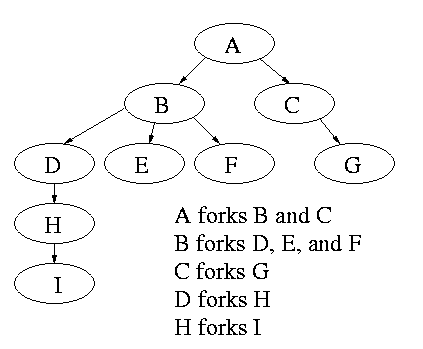

# Process

> 지난 주는 의도치 않게 스택 영역과 힙 영역에 집중해서 글을 썼다. 이번 주부터 제대로 프로세스 전체에 대한 글을 작성해보려 한다.

---

### Process와 Thread의 정의!

Process 

> A process can be thought of as a program in execution.(실행 중인 프로그램을 프로세스라 한다.)

Thread

> A thread is the unit of execution within a process. A process can have anywhere from just one thread to many threads. (스레드는 프로세스 속에 있으며, 프로세스는 1개 이상의 스레드를 가진다.)

---

### PCB

> 각각의 process는 OS 안에서 Process Control Block 이라고 불린다.(Task Control Block으로 불리기도 함.)

- 1개의 프로세스는 1개의 PCB를 가진다.
- 이 PCB에는 PID와 Process Scheduling과 같은 정보들이 존재한다.
- 우리가 말하는 OS는 Multiprocessing이 되는 Time-Sharing OS. 때문에 당연히 한 OS 안에 프로세스가 여러개 있을 것이고, PCB 또한 여러개 있을 것이다. 이 wild하게 존재하는 여러 PCB들을 array로 만들면 **Process Table**  
- 하지만, 단순히 array 방식으로 만들면 OS가 제공할 수 있는 프로세스의 개수가 제한된다는 단점이 있다. 
- 이를 극복하기 위해서 링크드 리스트 방식을 사용하는 것이다.  (아마도 prev 포인터와 next 포인터 모두를 가지는 doubley-linked-list 방식으로 구현되지 않을까 싶다.)

---

### Process State

new - The process is being created.

running - Instructions are being executed.

waiting - The process is waiting for some event to occur.

Ready - The process is waiting to be assigned to a processor. (new와 running 사이)

Terminated - The process has finished execution.

 

- Ready 상태에 있는 프로세스들을 묶어서 큐로 구성하고 그 큐를 **Ready Queue**라 한다. 

  > Ready Queue: Ready 상태의 프로세스들을 관리하기 위한 큐 형태의 자료구조. 일반적으로 PCB들을 링크드 리스트로 연결하여 구현
  >
  > 

- Ready 상태에서 CPU를 받게 되면 Running 상태가 된다. 

 

Q. Waiting 상태의 프로세스가 여러개 있을 수 있을까??

A. 그렇다. 하지만 waiting의 이유는 각 프로세스마다 다를 수 있다. OS는 waiting하는 이유에 따라 별도의 큐를 사용한다. 결국, OS는 프로세스가 생성되면 하나의 PCB를 할당하고 그 프로세스를 일련의 조건에 따라 다른 상태로 전이 시킨다. (상태 전이를 위해 ReadyQueue, WaitingQueue 같은 것들이 필요)

---

### 🔴Process Scheduling

> 프로세스의 상태를 나누는 이유는 스케쥴링 때문이다.

- The objective of multiprogramming is to have some process running at all times, to maximize CPU utilization.(멀티프로그래밍의 목적은 CPU의 효율을 최대로 높이는 것이다. 이를 위해서는 특정한 프로세스가 항상 실행 중이어야 한다.)
- The objective of time sharing is to switch the CPU among processes so frequently that users can interact with each program while it is running.(실질적으로 이 여러 프로세스들이 **actual same time** 에 동시에 실행되는 것은 아니다! 워낙 자주, 빠르게 CPU가 옮겨다니기 때문에 사람의 감각으로는 그 차이를 파악하지 못하는 것일 뿐이다.)
- To meet these objectives, the process scheduler selects an available process(possibly from a set of several available processors) for program execution on the CPU.
  - For a single-processor system, there will never be more than one running system.
  - If there are more processes, the rest will have to wait until the CPU is free and can be rescheduled.

 

Q. Running state의 프로세스가 CPU를 빼앗기는 경우는 I/O request가 왔을 때 뿐인가?

A. 아니다. Running state의 프로세스가 CPU를 빼앗기게 되는 경우는 크게 2가지가 존재한다.

첫번째로는 I/O request가 올 때, 두번째로는 Running state의 프로세스보다 더 높은 우선순위의 프로세스가 오는 경우이다.

하지만, 이 두가지 경우에는 큰 차이가 존재한다. I/O request가 오는 경우에는 해당 I/O request가 끝날 때까지 기다려야만 한다. 때문에 현재 Running state의 프로세스는 Waiting queue에 들어가게 된다. 반면, 더 높은 우선순위의 프로세스가 오는 경우에는 단순히 CPU를 뺏기기만 하는거지 기다릴 이유가 없다. 때문에 바로 Ready queue에 들어간다.

---

### 🔴Context Switch

- 위에서 언급했듯이, 프로세스를 수행하는 도중 더 높은 우선순위를 가지는 프로세스가 오게 되면, 원래 하던 프로세스에 interrupt를 걸고 더 높은 우선순위의 프로세스를 처리한다.
- Such operations happen frequently on general-purpose system.
- When an interrupt occurs, the system need to save the current **context** of the process currently running on the CPU so that it can restore that context when its(새롭게 들어온 우선순위가 높은 프로세스) processing is done. (interrupt가 걸려서 CPU가 이동하기 전에, 지금까지 이 프로세스에서 했던 작업들을 저장해두고 가야 다음에 돌아왔을 때 이어서 처리할 수 있다.)
- The **Context** is represented in the PCB of the process. (이 context를 저장해놓을 공간이 필요하기 때문에!! 프로세스마다 하나의 PCB를 할당하는 것이다.) 
- Switching the CPU to another process requires performing a state save of the current process and a state restore of a different process. 이 두 동작을 합쳐서 우리는 `Context Switch` 라 부른다. 
- It's speed varies from machine to machine, depending on the memory speed, the number of registers that must be copied, and the existence of special instructions.(such as a single instruction to load or store all registers.)

 

Q. Context Switching은 오버헤드가 없는 동작일까?

A.아니다. Context Switching은 pure overhead를 갖는다.(1번당 5 microseconds on today's hardware) 왜냐하면, Switching을 하는 동안에는 CPU가 다른 일을 할 수 없다. 

---

### Process Creation

- A process may create several new processes, via a create-process system call(fork()), during the course of execution.
- The creating process is called a **parent process** , and the new processes are called the **children of that process**.
- Each of these new processes may in turn(차례로) create other processes, forming a tree of processes.
- 
- When a process creates a new process, two possibilities exist in terms of execution
  	1. The parent continues to execution concurrently with its children.
   	2. The parent waits until some or all of its children have terminated.
- There are also two possibilities in terms of the address space of the new process.
  1. The child process is a duplicate of the parent process.(It has the same program and data as the parent.)
  2. The child process has a new program loaded into it.