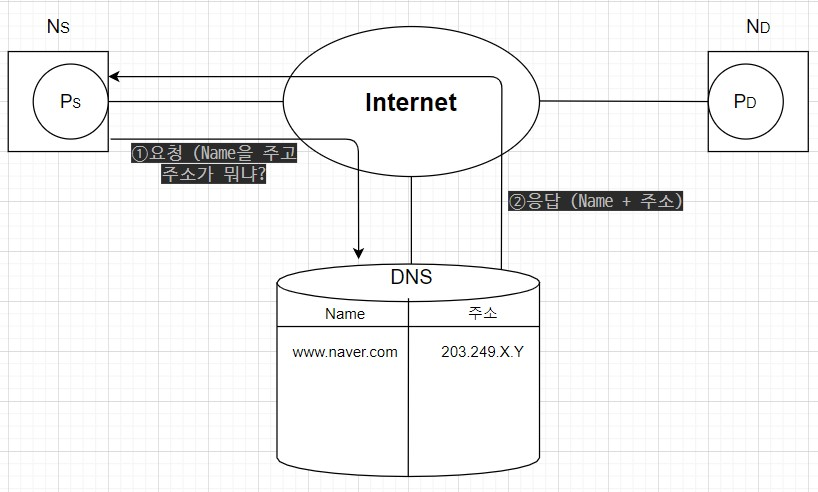

# 👍www.naver.com을 검색하면 어떤 과정을 거쳐서 우리의 화면에 그려지는가?

> https://deveric.tistory.com/97
>
> 이 블로그 게시물에 도움을 많이 받았습니다. 정말 이해하기 쉽게 설명해주셨습니다. 아래에 작성하는 내용 또한 이 블로그의 내용을 바탕으로 조금씩 내용을 추가하면서 작성할 예정입니다.

---

## 1. 브라우저의 URL 파싱

URL 스킴의 문법을 구분한다면 9개의 부분으로 나뉜다.

`<스킴>://<사용자 이름>:<비밀번호>@<호스트>:<포트>/<경로>;<파라미터>?<질의>#<프래그먼트>`

이 9개의 부분들은 모두 각각의 구분자에 의해 구분되어 있음을 알 수 있다. 구분자가 존재하기 때문에 각각의 요소들을 파싱할 수 있다.(아마도 정규표현식으로 할 것 같다.)

사실 이 모든 컴포넌트를 가지는 URL은 거의 없다. URL의 가장 중요한 세가지 컴포넌트는 스킴, 호스트, 경로다.

대부분의 URL은 동일하게 '스킴://호스트/경로' 의 구조로 되어 있다.

---

## 2. HSTS 목록 조회

HSTS(HTTP Strict transport security), HTTP를 허용하지 않고 HTTPS를 사용하는 연결만 허용하는 기능이다. 만약 HTTP로 요청이 왔다면 HTTP 응답 헤더에 "Strict Transport Security"라는 필드를 포함하여 응답하고 이를 확인한 브라우저는 해당 서버에 요청할 때 HTTPS만을 통해 통신하게 된다. 그리고 자신의 HSTS캐시에 해당 URL을 저장하는데 이를 HSTS 목록이라고 부른다.

이를 통해 브라우저에서는 이 HSTS 목록 조회를 통해 해당 요청을 HTTPS로 보낼지 판단한다. HSTS목록에 해당 URL이 존재한다면 명시적으로 HTTP를 통해 요청한다 해도 브라우저가 이를 HTTPS로 요청한다.

---

## 3. URL을 IP 주소로 변환

우리는 보통 호스트에 www.naver.com 과 같은 도메인 이름을 작성한다. 하지만, 이런 주소로는 컴퓨터끼리 통신할 수 없다. 이를 인터넷 상에서 컴퓨터가 읽을 수 있는 IP 주소로 변환해야만 서로 통신이 가능하게 된다. 

도메인 이름을 IP 주소로 변환하는 과정은 크게 두 개로 분류된다.

1. 가장 먼저, 자신의 localhost 파일과 [웹 캐시](https://github.com/Dongkyun-Jang/TIL/blob/master/web/%E2%9D%93Cache.md)에 해당 URL이 존재하는지 확인하고, 있다면 그것을 불러온다.

2. 존재하지 않는다면 도메인 주소를 IP주소로 변환해주는 DNS(Domain Name System) 서버에 요청하여 해당 URL을 IP 주소로 변환한다.

DNS는 `도메인 이름`과 `IP 주소` 간의 매핑을 관리하여 마치 전화번호부와 같은 기능을 한다. 동작 방식은 다음과 같다. 

 여기서 또 다른 의문이 들 수 있는데, "그렇다면 DNS는 어떻게 찾아갈 수 있느냐?" 이다.

이를 이해하기 위해서는 `Well-Known Port Number`에 대해 알아야 한다.

`Well-Known Port Number`는 `1-1023`번까지의 포트 번호를 의미하며, IANA에서 관리한다. 이 포트 번호들은 서버 측에서 각 용도별로 예약되어 동작된다. (포트 번호들이 어떻게 나뉘어 사용되는지는 [이곳](https://whackur.tistory.com/98)에서 확인이 가능하다.)

주요한 `Well-Known Port`는 다음과 같다.

- 1 : TCPMUX (TCP Port service multiplexer) 
- 7 : ECHO (echo) 
- 13 : DAYTIME (daytime)
- 20 : FTP - DATA (FTP의 데이터 전송)
- 21 : FTP - CONTROL (FTP의 데이터 전송 제어) 
- 23 : TELNET (터미널 에뮬레이션)
- 25 : SMTP (메일 메세지 전송 프로토콜)
- 53 : DNS (DNS 질의응답)
- 80 : HTTP (웹 전송)
- 123 : NTP (Network Time Protocol)
- 179 : BGP (BGP 라우팅 프로토콜)
- 443 : HTTPS

결국, 우리는 이미 53번 포트가 DNS임을 알고 있고 53번 포트를 통해 DNS에 접근한다. 

---

**여기서부터 훨씬 더 자세한 내용이기 때문에 일단은 위에까지만 이해하면 충분하다고 생각한다.**

실질적으로 우리가 53번 포트를 통해 접근하는 DNS는 Local DNS이다. 하지만, DNS는 Local만 있는 것이 아니며, Local DNS에 모든 정보들이 저장되어 있는 것이 아니다. 떄문에 또 다른 DNS로 해당 도메인 이름에 대한 IP 주소를 찾을 때까지 재귀적인 접근이 필요하다.

이에 대한 설명이 [아마존의 DNS에 대한 설명](https://aws.amazon.com/ko/route53/what-is-dns/) 하단에 잘 정리되어 있다. 하지만, 처음 이 아마존의 글을 읽으면 이해하기 상당히 어렵다. 이 때문에 다른 설명을 찾게 되었고 굉장히 좋은 설명을 찾게 되어서 아래에 그대로 옮긴다. (출처: 넷매니아즈, https://www.netmanias.com/ko/post/blog/5353/dns/dns-basic-operation)

 

오늘은 DNS(Domain Name System)의 아주 기본적인 동작 원리에 대해서 설명드리겠습니다.

먼저 모든 단말(PC)은 DNS 서버의 IP 주소가 설정되어 있어야 합니다. 보통 PC는 DHCP 프로토콜로 IP 주소를 할당 받으면서 DNS 서버 IP 주소를 DHCP Option 6을 통해 함께 받습니다. (보통 2개의 DNS IP 주소를 받지요. Primary DNS 서버가 죽었을때 Secondary DNS 서버에 물어 보기 위해서...) 제 PC의 예를 보여 드리겠습니다.  DNS 서버 주소가 203.248.252.2와 164.124.101.2로 설정 되어 있습니다. 이 2개의 주소는 LG U+ DNS 서버 주소입니다. ([www.whois.co.kr](http://www.whois.co.kr/)에서 IP 주소 관련 정보 확인이 가능함)

1. 이제 아래 그림과 같이 PC 브라우저에서 www.naver.com을 입력합니다. 그러면 PC는 미리 설정되어 있는 DNS (단말에 설정되어 있는 이 DNS를 Local DNS라 부름, 제 PC의 경우는 203.248.252.2)에게 "www.naver.com이라는 hostname"에 대한 IP 주소를 물어봅니다.
2. Local DNS에는 "www.naver.com에 대한 IP 주소"가 있을 수도 없을 수도 있습니다. 만약 있다면 Local DNS가 바로 PC에 IP 주소를 주고 끝나겠지요. 본 설명에서는 Local DNS에 "www.naver.com에 대한 IP 주소"가 없다고 가정합니다.
3. Local DNS는 이제 "www.naver.com에 대한 IP 주소"를 찾아내기 위해 다른 DNS 서버들과 통신(DNS 메시지)을 시작합니다. 먼저 Root DNS 서버에게 "너 혹시 www.naver.com에 대한 IP 주소 아니?"라고 물어봅니다. 이를 위해 각 Local DNS 서버에는 Root DNS 서버의 정보 (IP 주소)가 미리 설정되어 있어야 합니다.
4. 여기서 "Root DNS"라 함은 좀 특별한 녀석인데요(기능의 특별함이 아니고 그 존재감이..). 이 Root DNS 서버는 전세계에 13대가 구축되어 있습니다. 미국에 10대, 일본/네덜란드/노르웨이에 각 1대씩... 그리고 우리나라의 경우 Root DNS 서버가 존재하지는 않지만 Root DNS 서버에 대한 미러 서버를 3대 운용하고 있다고 합니다.
5. Root DNS 서버는 "www.naver.com의 IP 주소"를 모릅니다. 그래서 Local DNS 서버에게 "난 www.naver.com에 대한 IP 주소 몰라. 나 말고 내가 알려주는 다른 DNS 서버에게 물어봐~"라고 응답을 합니다.
6. 이 다른 DNS 서버는 "com 도메인"을 관리하는 DNS 서버입니다(com 도메인은 Generic Top Level Domain(gTLD) 이다.).
7. 이제 Local DNS 서버는 "com 도메인을 관리하는 DNS 서버"에게 다시 "너 혹시 www.naver.com에 대한 IP 주소 아니?"라고 물어봅니다.
8. 역시 "com 도메인을 관리하는 DNS 서버"에도 해당 정보가 없습니다. 그래서 이 DNS 서버는 Local DNS 서버에게 "난 www.naver.com에 대한 IP 주소 몰라. 나 말고 내가 알려주는 다른 DNS 서버에게 물어봐~"라고 응답을 합니다. 이 다른 DNS 서버는 "naver.com 도메인"을 관리하는 DNS 서버입니다.
9. 이제 Local DNS 서버는 "naver.com 도메인을 관리하는 DNS 서버"에게 다시 "너 혹시 www.naver.com에 대한 IP 주소 있니?"라고 물어봅니다.
10. "naver.com 도메인을 관리하는 DNS 서버"에는 "www.naver.com 호스트네임에 대한 IP 주소"가 있습니다. 그래서 Local DNS 서버에게 "응! www.naver.com에 대한 IP 주소는 222.122.195.6이야~"라고 응답을 해 줍니다.
11. 이를 수신한 Local DNS는 www.naver.com에 대한 IP 주소를 캐싱을 하고(이후 다른 넘이 물어보면 바로 응답을 줄 수 있도록) 그 IP 주소 정보를 단말(PC)에 전달해 줍니다.

이와 같이 Local DNS 서버가 여러 DNS 서버를 차례대로 (Root DNS 서버 -> com DNS 서버 -> naver.com DNS 서버) 물어봐서 그 답을 찾는 과정을 **Recursive Query**라고 부릅니다

---

## 4. 라우터를 통해 해당 서버의 게이트웨이까지 이동

DNS서버에서 IP 주소를 받았으니 이제 해당 서버로 요청을 보낸다. 하지만, IP 주소만 알고 있을뿐  어떻게 가야 할지 모르는 상태이다. 

이 경로는 네트워크 장비인 라우터의 라우팅을 통해 이루어진다. 라우터에서는 라우팅 테이블을 통해 해당 요청이 어떤 경로를 통해 가야할지 경로를 지정해준다. 이를 통해 해당 IP 주소를 찾아갈 수 있다.

 

---

## 5. ARP를 통해 IP 주소를 MAC 주소로 변환

ARP(Address Resolution Protocol)를 통해 IP 주소를 MAC 주소로 변환

실질적인 통신을 하기 위해서는 논리 주소인 IP 주소를 물리 주소인 MAC 주소로 변환해야 한다. 이를 위해 해당 네트워크 내에서 ARP를 브로드캐스팅한다. 해당 IP 주소를 가지고 있는 노드는 자신의 MAC 주소를 응답한다. 즉, ARP request는 broadcast 하지만 ARP reply는 unicast 하다는 것을 알 수 있다.

조금 더 쉬운 이해를 위해 위에 있는 그림을 바탕으로 설명한다. 먼저 이전 단계에서 연속적인 라우팅을 통해 10.20.30.1 주소까지 도착한다. 하지만, 우리가 원하는 IP 주소는 10.20.30.6 이다. 때문에 10.20.30.1에 연결된 모두에게(broadcast) ARP 요청을 보낸다. (이 요청 속에는 송신자의 물리주소, 논리주소와 수신자의 논리주소가 들어있을 것이다.)  ARP 요청을 받은 네트워크 중 자신의 논리주소와 ARP 요청 속 수신자의 논리주소가 같다면 ARP 응답을 보낸다.(이 응답 속에는 송신자의 물리주소, 논리주소와 수신자의 물리주소, 논리주소가 들어있을 것이다.) 이를 통해 송신자는 수신자의 MAC 주소를 알게 된다.

[ARP 프로토콜에 대한 이야기](https://aws-hyoh.tistory.com/entry/ARP-%EC%89%BD%EA%B2%8C-%EC%9D%B4%ED%95%B4%ED%95%98%EA%B8%B0)

---

## 6. 대상 서버와 TCP 소켓 연결

이제 대상 서버와 통신하기 위해 TCP 연결을 진행한다. 연결은 `3-way-handshake`를 통해 이뤄진다. 제일 중요한 것은 https 요청일 경우 `3-way-handshake` 이후 `TLS-handshake`가 추가로 필요하다는 점이다. `TLS-handshake`를 통해 서버와 클라이언트는 암호화 통신을 수행할 수 있다.

---

## 7. HTTP(HTTPS) 프로토콜로 요청, 응답

이제 연결이 확정되었으니 www.naver.com을 달라고 서버에게 요청한다. 서버에서 이 요청을 받고, 이 요청을 수락할 수 있는지 검사한다. 그리고 서버는 이 요청에 대한 응답을 생성하여 브라우저에게 전달한다.

---

## 8. 브라우저에서 응답을 해석

서버에서 응답한 내용들은 HTML, CSS, JavaScript 등으로 이루어져 있다. 이를 브라우저에서 해석하여 그려준다. 이를 통해 우리는 네이버 홈페이지를 볼 수 있게 된다.

---